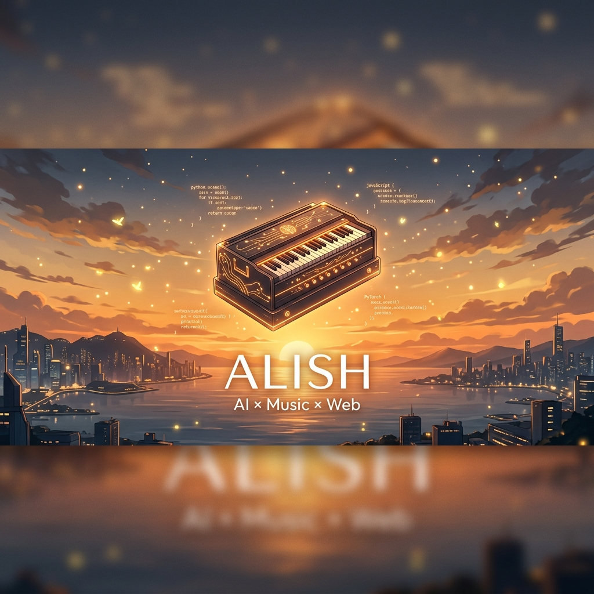

<div align="center">

<!-- Premium Hero Banner -->


<br/>

<!-- System Log / Animated Typing -->


<br/>

<!-- Social Badges -->
[](https://github.com/Al1sh-creator)
&nbsp;
[](https://github.com/Al1sh-creator)

</div>

---

## 🧠 Core Architecture

```python
class Architect:
    def __init__(self):
        self.identity = "Alish"
        self.origin   = "🇮🇳 India"
        self.vibe     = "High-agency building & clean architecture"
        self.domains  = [
            "Web Audio API & Browser DSP",
            "Generative AI & LLM Orchestration",
            "Real-time Interactive Systems"
        ]
        self.philosophy = "The browser is a canvas for high-performance art."

    def build(self):
        return "Pushing boundaries of what's possible on the open web 🎹🤖"
```

---

## 📊 Developer Metrics

<div align="center">

<!-- Stats Row -->

&nbsp;


<br/><br/>

</div>

---

## 🛠️ Expertise & Tooling

<div align="center">

<!-- Skill Icons Grid -->
[](https://skillicons.dev)

</div>

---

## 🛸 Selected Domains

I push the boundaries of real-time web experiences through three primary lenses:

- 🎹 **Sonic Engineering**: Crafting high-fidelity musical instruments and audio processors entirely in-browser.
- 🤖 **Cognitive Interfaces**: Integrating persona-driven AI agents into dynamic, real-time environments.
- ⚡ **Performance Systems**: Building low-latency applications that handle complex data and media streams.

> [!TIP]
> Visit my **Pinned Repositories** below for active codebase deep-dives.

---

## 📈 Global Activity

<div align="center">
  
</div>

---

## 💬 Connect

<div align="center">

Have a question about my work, open-source tech, or the future of AI and music? 

[](https://github.com/Al1sh-creator/Al1sh-creator/issues/new?template=ama.md&title=%5BAMA%5D+)

</div>

---

<div align="center">

*"The code is the canvas; the browser is the stage."*

⭐ **If you find something helpful, feel free to leave a star!** ⭐

</div>
